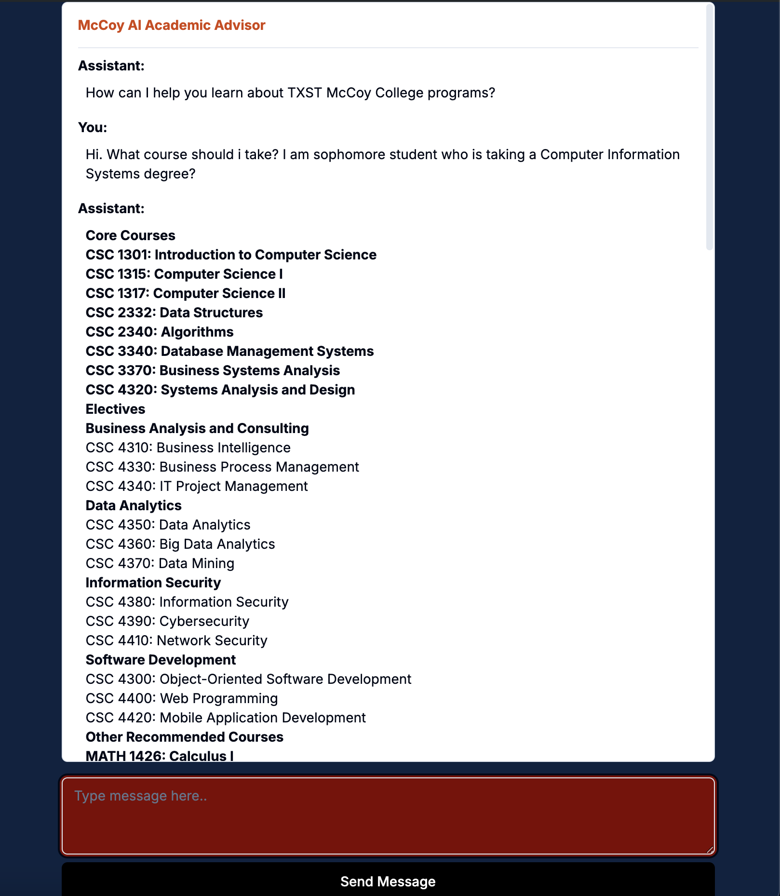

**Agentic Academic Advisor: A RAG-based System for Tailored University Course Recommendations**

---

### 1. **Project Overview**

Traditional university advising often fails to align with individual students' goals and aspirations, adhering too strictly to predefined course structures. This project aims to build an agentic Retrieval-Augmented Generation (RAG) system that can parse a 4000-page university course catalog and provide customized academic advice through a chat interface. This system will facilitate students in making informed decisions about their courses, considering their academic and career objectives, rather than imposing a rigid curriculum-based pathway.

---

### 2. **Problem Statement**

- **Current Limitations**: Academic advisors often emphasize strict adherence to curriculum requirements rather than tailoring advice to students' personal academic and career goals. This approach lacks flexibility, leaving students feeling disconnected from the academic guidance process.
- **Desired Outcome**: A system that understands a student's unique interests, ambitions, and constraints, providing customized course recommendations that align with their personal objectives while meeting degree requirements.

## How to run Acadmic Advisor RAG? 

```npm install ```

``` npm run dev ```

## Demo




## Where is the Agentic RAG system? 
This part is still under works but the ``` txst-agentic-rag-system.ipynb``` contains the logic of what a basic system looks like. 



